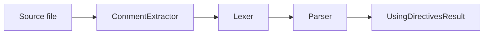

# Using Directives Parser

The `scala3-directives-parser` module parses `//> using` directives from source files. 
It is shared between the Scala 3 compiler (REPL, test harness) and
[Scala CLI](https://github.com/VirtusLab/scala-cli).

The public entry point is `UsingDirectivesParser.parse(IndexedSeq[Char]): UsingDirectivesResult`.

## Pipeline

Parsing proceeds in three phases:



1. **CommentExtractor** scans the source and collects `//> using` lines from the
   directive region at the top of the file.
2. **Lexer** tokenizes each directive line into a stream of tokens.
3. **Parser** converts the token stream into `UsingDirective` nodes and diagnostics.

## Directive region

Directives must appear in a **preamble** at the top of the file, before the first
line of code. The result includes a `codeOffset` field: the byte offset in the
original file where code begins.

### Allowed before code

- Blank lines
- A `#!` shebang on the very first line only
- Line comments (`// ...`, but not `//> using ...`)
- Block comments (`/* ... */`), including multi-line and nested comments
- Leading whitespace (spaces or tabs) before `//> using`
- A UTF-8 BOM (`\uFEFF`) at the start of the file (stripped before parsing)

### Not allowed / ignored

- Directives inside block comments, line comments, or ScalaDoc comments
- Directives after the first line of code (ignored with a warning)
- A `package` declaration or any other code before directives (treats the file as
  having no directive region; post-code directives warn)
- `//> using` on the same line after a block comment closes (`/* comment */ //> using ...`)
- Inline block comments within a directive line (not supported; `/*` becomes part of the key)

### Prefix requirement

The exact prefix `//> using` is required (with a single space after `>`):

- `//> using scala 3` — valid
- `//>using scala 3` — treated as code (no space after `>`)
- `//>  using scala 3` — warning: invalid prefix; treated as code
- `//>	using scala 3` — warning: tab after `>` is invalid; treated as code
- `//> notUsing foo` — treated as code

## Grammar

```
Directives ::= { Directive }
Directive  ::= "using" Key Values
Key        ::= Ident                  (dotted keys are a single Ident, e.g. "test.dep")
Values     ::= { [Comma] Value }
Value      ::= StringLit | BoolLit | Ident
```

When no values follow the key, a single `EmptyVal` is produced (equivalent to a
flag with no argument).

Each directive occupies one line. Multiple directives are written on consecutive
lines:

```scala
//> using scala 3
//> using dep com.lihaoyi::os-lib:0.11.4
```

## Lexical rules

The lexer operates on the content of a single directive line (including the
`//> ` prefix). Positions in tokens are relative to the original source file.

### Bare identifiers and values

A bare token is a maximal run of non-whitespace characters. It stops before:

- Whitespace
- A comma followed by whitespace or end-of-line (see comma rule below)
- A double quote `"` (whitespace is required before a quote; see errors below)

Bare tokens that are exactly `using`, `true`, or `false` are recognized as
special tokens. All other bare tokens become `Ident` values.

Values may contain `.`, `:`, `=`, and embedded commas (with no following
whitespace). Dotted keys like `test.dep` are stored as a single key string; the
lexer does not split dots in value position.

### Double-quoted strings

Double-quoted strings support these escape sequences:

| Escape | Meaning |
|--------|---------|
| `\n`   | newline |
| `\t`   | tab |
| `\r`   | carriage return |
| `\\`   | backslash |
| `\"`   | double quote |
| `\uXXXX` | Unicode code point (4 hex digits) |

An unterminated string produces a lexer error.

### Backtick-quoted identifiers

Backtick-quoted text (`` `native-gc` ``) is treated as a bare `Ident` with the
backticks stripped. Empty backtick identifiers (`` `` ``) produce a lexer error.

### Boolean literals

The bare tokens `true` and `false` (case-sensitive) are parsed as boolean values
when they appear in value position.

### Commas separating values (deprecated)

A comma is a **value separator** only when immediately followed by whitespace or
end-of-line:

- `a, b` — two values (`a` and `b`); comma separator is deprecated and emits a warning
- `a,b` — one value (`a,b`)
- `a ,b` — two values (`a` and `,b`); no comma separator
- `--enable-url-protocols=http,https` — one value (embedded comma)
- `tabby:tabby:0.2.3,url=https://example.com/tabby.jar` — one value (Coursier syntax)

Commas as separators are **deprecated**. Use whitespace separation instead.

Additional comma edge cases:

- A lone `,` as a value is accepted literally
- A trailing comma (`a, b,`) produces two values and two deprecation warnings
- A double comma (`a,, b`) produces values `a,` and `b`, with warnings about
  the value ending in a comma and about comma separators

## Value model

Each parsed value is a `DirectiveValue`:

| Variant                                | Description                     |
|----------------------------------------|---------------------------------|
| `StringVal(value, isQuoted, position)` | A string, either quoted or bare |
| `BoolVal(value, position)`             | Boolean `true` or `false`       |
| `EmptyVal(position)`                   | No value provided after the key |

Two accessors reconstruct the text:

- `stringValue` — content without surrounding quotes
- `rawText` — source form (`"hello"` for quoted strings, bare text otherwise)

## Diagnostics

Diagnostics are returned as `UsingDirectiveDiagnostic(message, severity, position)`.

| Severity    | When                                                                   |
|-------------|------------------------------------------------------------------------|
| **Error**   | Parse failure: missing key, unexpected token, lexer error              |
| **Warning** | Deprecated comma separator; directive after code; invalid `//>` prefix |

Positions are 0-based (`line`, `column`, `offset` in the original file).

On parse errors the parser skips to the next line and continues.

## Examples

### Accepted

```scala
//> using scala 3
//> using dep com.lihaoyi::os-lib:0.11.8
//> using dep com.lihaoyi::os-lib:0.11.8 com.lihaoyi::upickle:4.4.3
//> using test.dep munit::munit:1.3.3
//> using scalacOption "-Xfatal-warnings"
//> using publish.doc true
//> using toolkit
//> using dep tabby:tabby:0.2.3,url=https://example.com/tabby.jar
//> using dep com.lihaoyi::os-lib:0.11.8,exclude=com.lihaoyi%%geny
//> using packaging.graalvmArgs --enable-url-protocols=http,https
//> using `native-gc`
```

### Warnings (still parsed where noted)

```scala
//> using dep a, b                  // deprecated comma separator; both values parsed
//> using dep a,, b                 // value "a," ends with comma; comma separator
val x = 1
//> using scala 3                   // ignored: directive after code
```

```scala
package x
//> using scala 3                   // ignored: code (package) before directive
```

```scala
//>  using scala 3                  // invalid prefix (extra space); treated as code
```

### Errors

```scala
//> using                           // missing key after `using`
//> using using foo                 // `using` cannot be a key
//> using true foo                  // boolean literal cannot be a key
//> using dep "unterminated         // unterminated string literal
```
