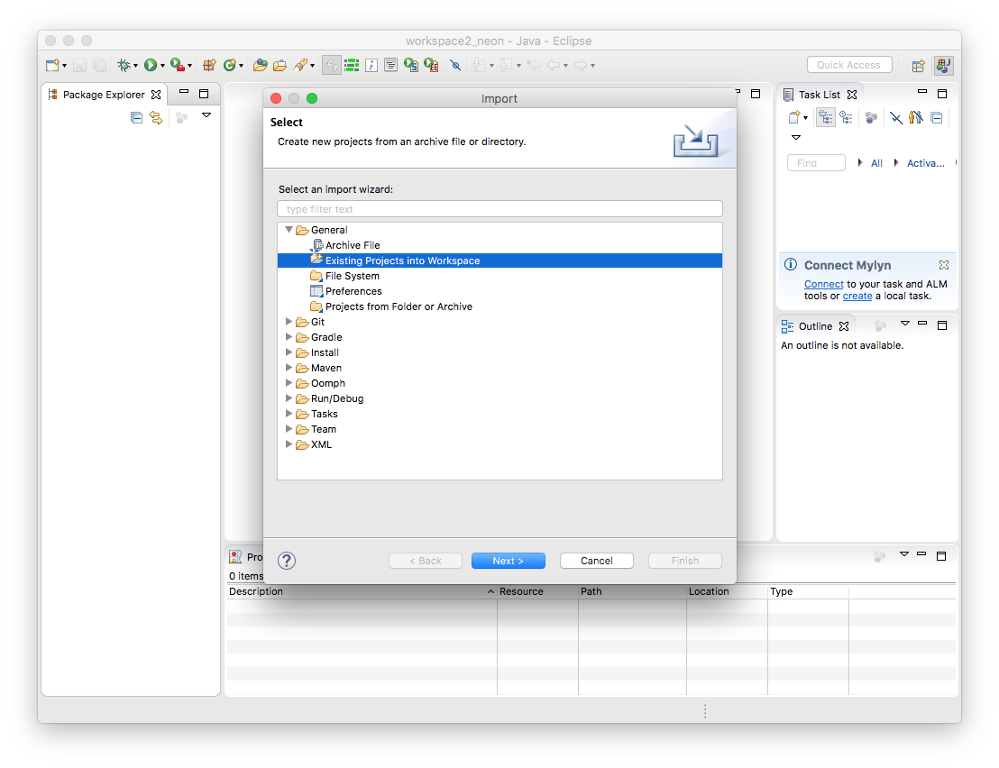
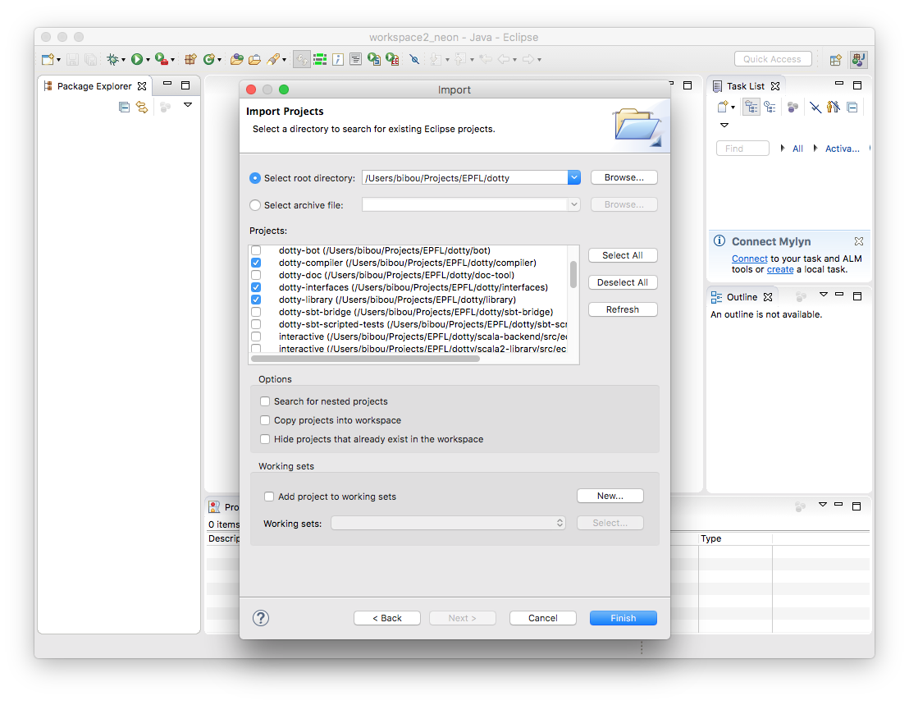
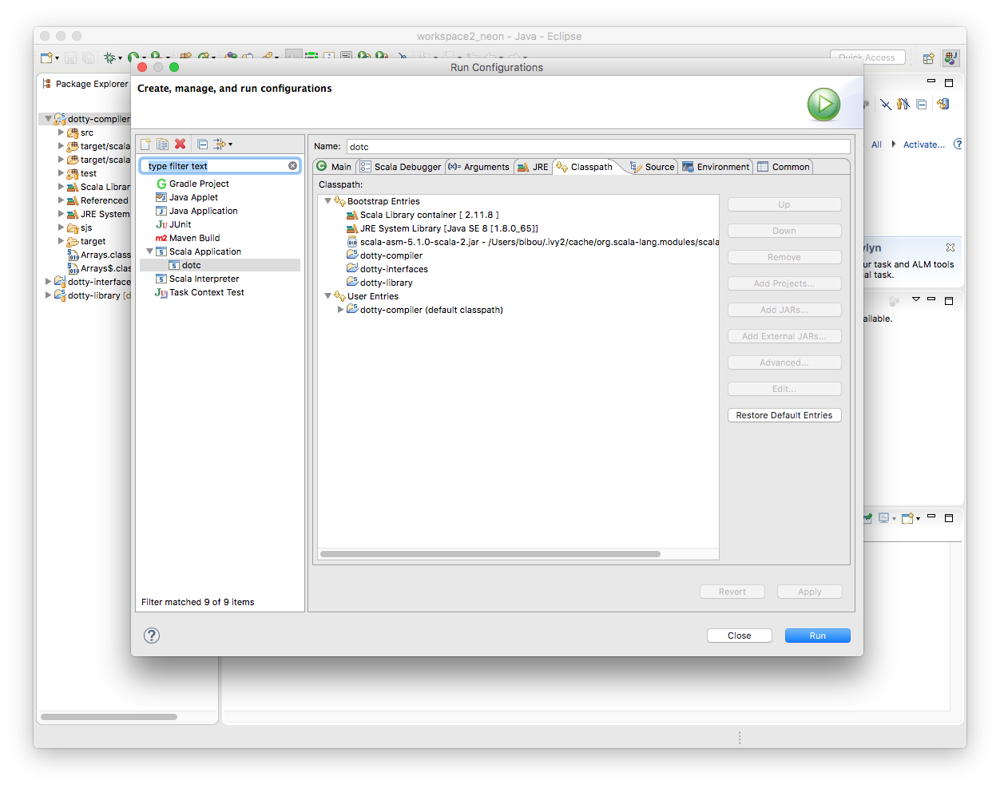

Setup
-----------

You can setup Eclipse by using [Scala IDE for Eclipse](http://scala-ide.org/) to run Dotty. Alternatively you can download 
your Eclipse distribution of choice and enable the Scala IDE from the Eclipse Marketplace, separately.

1. Clone Dotty's repository from Github (and run `sbt managedSources` as described in 
[Getting Started](getting-started.md)) 
2. Generate the Eclipse configuration files:
```shell
$ sbt eclipse
```

- Note: It is recommended to change the default output folder (in `Properties > java
   build path > Source`) to `dotty/classes` instead of `dotty/bin` because
   `dotty/bin` is reserved for shell scripts.

Optional: if you have `CLASSPATH` defined:

1. Update your classpath to contain any new required external libraries to run
   `./bin/dotc`, `./bin/dotr` outside of Eclipse.

1. Open the `Run Configurations` tab, and edit the `tests` configuration so
   that it contains a `CLASSPATH` variable which reflects the current
   `CLASSPATH`.
   
   
Import to Eclipse
-----------------

First step is to import dotty to Eclipse. This is done by selecting `File > Import` from the menu and selecting
_Existing Projects into Workplace_. 



On the next window, select the bare minimum configuration to run Dotty. You will need the compiler, library and the 
interfaces.




Running/Debugging
---------------------------------------------------

To run/debug Dotty you have to create a new configuration from `Run > Run Configurations`. First select the project on the
package explorer and then select the aforementioned option. On the `Main` tab you must have `dotty-compiler` for the 
_Project_ and `dotty.tools.dotc.Main` for the _Main class_. Specify the arguments you want for the compiler on the
`Arguments` tab (e.g, flags and source files) and then proceed to the `Classpath` tab. There you must 
specify three `Bootstrap Entries` which are the compiler, interfaces and the library as shown in the screenshot below. 
Additionally you need to specify the scala-asm library as an external jar dependency. This can be found on your local
`~/.ivy2/cache/` directory.



The compiler can be run and debugged using the same configuration. 

