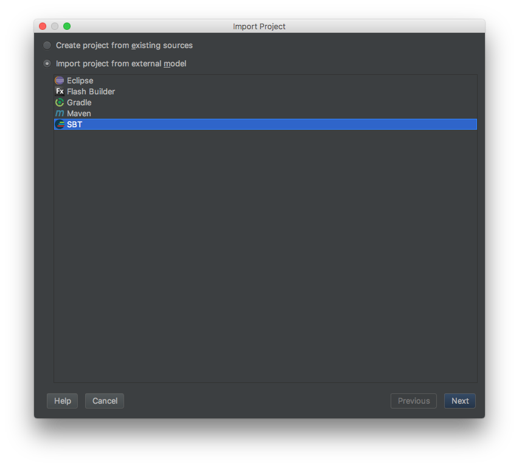
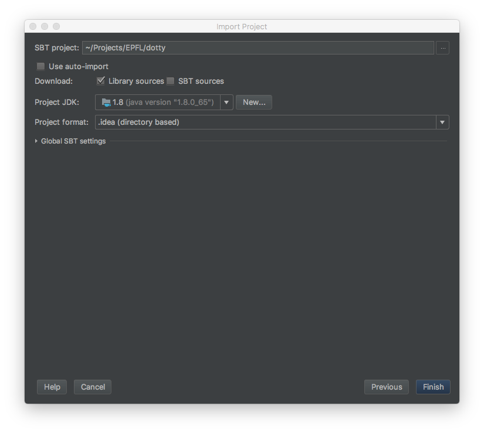
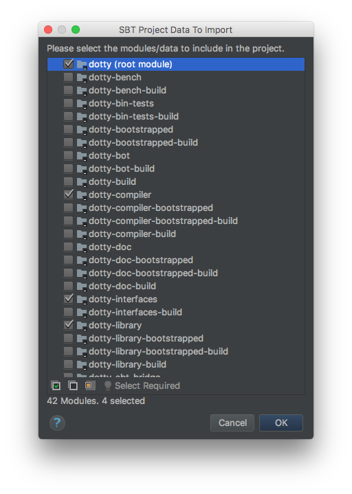
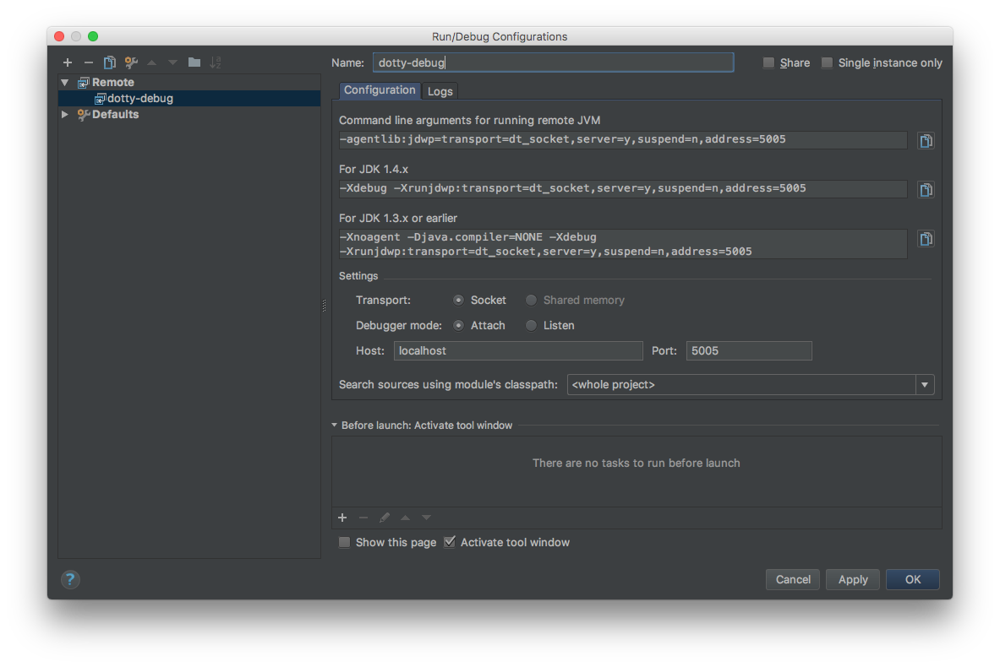

Setup
-----

You can setup IntelliJ [IDEA >= 2016.1](https://www.jetbrains.com/idea/nextversion) to run Dotty.

Assuming you have cloned Dotty's repository from Github (and run `sbt managedSources` as described in [Getting Started](getting-started.md)),
you can now proceed with importing it to IDEA by selecting the
corresponding option from the startup menu. Navigate on the corresponding directory and select it. Next, you need
to select the model of the import and as the screenshot shows, select SBT.



Next, you select the version of the JDK that this project relies on and verify that you have selected 1.8 (assuming
its installed on your local machine). Otherwise, specify it by pressing *New*.



Next we must select which modules we can import. IDEA version 2017.1 and earlier presents the full list of SBT modules
that are defined in Dotty. You can either select all (expect performance degradation if you select all) or
select only the `dotty` module. In order to do that, unselect all modules and select on `dotty`. IDEA, then, automatically
selects all the necessary dependencies and you press OK.



In IDEA version 2017.2 and later, wait for the project to load. Then right click on `dotty` in the project explorer
and select `Load/Unload Modules...`. Select only `dotty`, accept when IDEA asks to add its dependencies and press OK.

Running/Debugging
-------

To run the compiler you can do it either as an sbt command or a shell script. Open an external terminal.
For the first option, a test can be run as follows.

```shell
$ sbt
> dotc tests/pos/Arrays.scala
```
For the second option, the compiler can be run using a script in the `bin` directory:

```shell
$ ./bin/dotc tests/pos/Arrays.scala
```

If you are interested in debugging the compiler, you can use a remote debugging configuration.
This is done by launching dotc's JVM with the JDWP agent loaded. To that end, run
```shell
$ ./bin/dotc -debug tests/pos/Arrays.scala
```
Then when dotc starts, it will suspend and wait for a debugger to connect on port `5005`.
Next a configuration for Debug must be created in IDEA: 

> Run > Edit Configurations > Add New Configuration > (select) Remote



Under `Search sources using module's classpath` select `dotty`. Set breakpoints as desired.
Then hit the button whose tooltip says `Debug dotty-debug` (since we used `dotty-debug` for the name of
the sample configuration above) in IDEA to connect the debugger to the JVM and begin debugging. The default data on the debug configuration matches the enabled agent on the VM so, probably,
 you will not need to change anything else.
 
