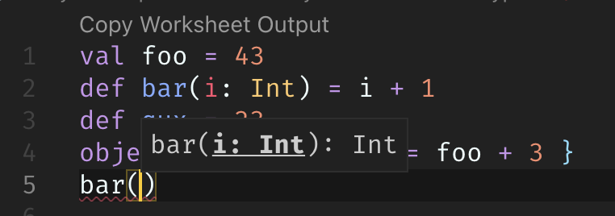

A worksheet is a Scala file that is evaluated on save, and the result of each
expression is shown in a column to the right of your program. Worksheets are
like a REPL session on steroids, and enjoy 1st class editor support: completion,
hyperlinking, interactive errors-as-you-type, etc. Worksheet use the extension
`.sc`.

How to use the worksheets
=========================
The only supported client for the Worksheet mode is [Visual Studio
Code](https://code.visualstudio.com/).

To use the worksheets, start Dotty IDE by [following the
instruction]("./ide-support.html") and create a new file `MyWorksheet.sc` and
write some code:

```scala
val xyz = 123
println("Hello, worksheets!")
456 + xyz
```

On top of the buffer, the message `Run this worksheet` appears. Click it to
evaluate the code of the worksheet. Each line of output is printed on the right
of the expression that produced it. The worksheets run with the classes of your
project and its dependencies on their classpath.


Note that the worksheet are fully integrated with the rest of Dotty IDE: While
typing, errors are shown, completions are suggested, and you can use all the
other features of Dotty IDE such as go to definition, find all references, etc.



Implementation details
======================

In overview, the worksheets extend the Language Server Protocol and rely on the
Dotty REPL to evaluate code.

## Evaluation
Each of the individual expressions and statements of the worksheet is extracted
and passed to the Dotty REPL. After the REPL has finished evaluating one unit of
input, it emits a special delimiter that indicates the end of the output for
this input. (See `dotty.tools.languageserver.worksheet.InputStreamConsumer`)

This process continues until all input has been evaluated.

The Dotty REPL is run in a separate JVM. The `Evaluator` (see
`dotty.tools.languageserver.worksheet.Evaluator`) will re-use a JVM if the
configuration of the project hasn't changed.

## Communication with the client
The worksheets extend the Language Server Protocol and add one request and one
notification.

### Run worksheet request
The worksheet run request is sent from the client to the server to request that
the server runs a given worksheet and streams the result.

*Request:*

 - method: `worksheet/run`
 - params: `WorksheetRunParams` defined as follows:
   ```typescript
   interface WorksheetRunParams {
       /**
        * The worksheet to evaluate.
        */
       textDocument: VersionedTextDocumentIdentifier;
   }
   ```

*Response:*

 - result: `WorksheetRunResult` defined as follows:
   ```typescript
   interface WorksheetRunResult {
       /**
        * Indicates whether evaluation was successful.
        */
       success: boolean;
   }
   ```

### Worksheet output notification
The worksheet output notification is sent from the server to the client to
indicate that worksheet execution has produced some output.

*Notification:*

 - method: `worksheet/publishOutput`
 - params: `WorksheetRunOutput` defined as follows:
   ```typescript
   interface WorksheetRunOutput {
       /**
        * The worksheet that produced this output.
        */
       textDocument: VersionedTextDocumentIdentifier;
   
       /**
        * The line number of the expression that produced this output.
        */
       line: int;
   
       /**
        * The output that has been produced.
        */
       content: string;
   }
   ```
