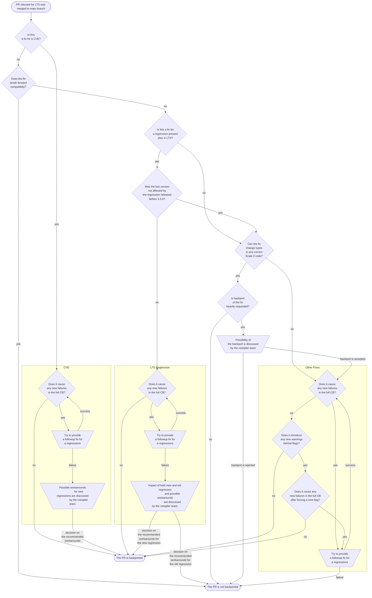

# Scala LTS maintenance and release cycle

## Scala LTS and Scala Next

Since Scala 3.3.0, there are always two versions of Scala 3 being developed at the same time: Scala Next and Scala LTS.

Scala Next continues all practices since before the 3.3.0. It maintains backward output (TASTy and binary) compatibility between all versions and forward output compatibility between patch releases of the same minor version. This version is being actively developed on the `main` branch. All new bug fixes and features will be merged to that version, i.e., to the `main` branch.

Scala LTS is a selected minor version (currently 3.3) that, unlike all other minor versions, has patch releases even though there is a newer minor version. Aside from our standard output compatibility guarantees, it is intended to preserve backward source compatibility. As no new features and bugfixes (with the rare exception of LTS-only hotfixes) will be developed for LTS, but instead, selected changes from the Next branch will be backported, there is no development branch for Scala LTS. All changes are merged to release branches instead. The commit marked with a full release tag for any version is the base for the release branch for the next version.

## What should be backported?

The decision of what changes merged to the `main` branch should be backported is taken according to the following flowchart:

## How should things be backported?

The backporting process is tracked by a GitHub Project in the lampepfl organization. Every PR merged to the `main` branch is automatically added to the `Needs Assessment` column. Those PRs are reviewed by the release officer or other appointed person. They can decide to remove them from the project (backport rejected) or to move them to the `Backporting in progress` column. If the PR with the backport has any differences from the original PR, the person doing the backport will ask the author and reviewers of the original change to review the backport. After merging the backport, the PR will be moved to the `Backport done` column and, after the release, to the `Released` column.

Maintainers can request backporting the entirety or a part of previously rejected PR by adding it to the `Backport requested` column.

## The release cycle

Releasing two different lines of the language at the same time requires some changes to the release procedures. We no longer release RC versions for patch releases of Scala Next. RC versions of patch releases of Scala LTS are released two weeks before the intended full release date. RC versions of Scala Next minor releases are released four weeks before the intended full release date.

The releases will be performed according to the 6-week cycles. Actions of each week are started to be performed on Tuesday. This is because the compiler team meetings take place on Mondays, and some concerns might be raised during them.

If we assume that the cycle starts on Tuesday `t` and `t + 1` is the next Tuesday, the timeline looks as follows:

- `t` - release of Scala Next and RC1 for the next Scala LTS patch.
- `t + 2` - release of the next Scala LTS patch. If the next Scala Next version is a minor version, RC1 of that version is released.
- `t + 6` - the start of the new release cycle

### Dealing with delays

It is possible that there will be problems in the RC releases that require fixes and further release candidates. We will not publish a full release in the same week as an RC. This means that delay can occur.

In the case of LTS releases, there are four weeks to fix the problem if the versions is to be released before the RC1 of the next patch. If we don't solve the issue two weeks before the start of the next release cycle, we will find a commit on the release branch of the current version that the problem was not yet present and release it as an RC. Before releasing the RC1 for the next version, we will either find a fix for the problem or rebase the next release branch so that the offending change is removed from the branch.

In the case of minor Scala Next releases, if we cannot have a satisfying RC on time, we can skip releasing the stable Scala Next version in the given release cycle. This means there may be cycles during which we release only Scala LTS.

Accounting for delays adds these points to the timeline above:

- `t + 4` - last possible moment to release RC for the Scala LTS patch, which is trying to fix a problem
- `t + 5` - If no RC exists for Scala LTS fixing a problem, a version based on the last non-problematic commit is released. Also, this is the last moment to release RC for the Scala Next minor. Otherwise, we will skip the Scala Next release in the next cycle.

### What is being released?

For the Scala LTS, what is released as an RC is always the current head of the release branch for the next release.

For the Scala Next minor releases RC, it is the head of the `main` branch.

For the Scala Next patches, there are no RCs. As a point of cut-off of the release, we are choosing one relatively recent commit from the `main` branch on which a full Open Community Build was run before the decision. The default choice here is the commit on which the last weekly community build was run.
