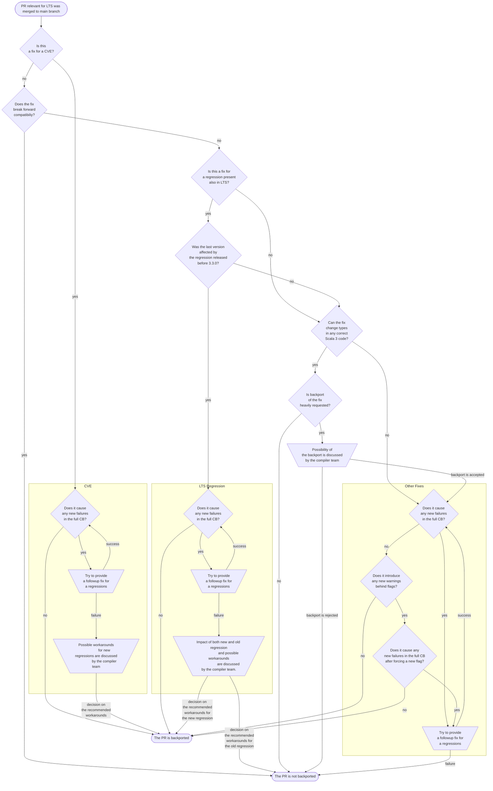

# Scala LTS maintenance and release cycle

## Scala LTS and Scala Next

Since Scala 3.3.0, there are always two versions of Scala 3 being developed at the same time: Scala Next and Scala LTS.

Scala Next continues all practices since before the 3.3.0. It maintains backward output (TASTy and binary) compatibility between all versions and forward output compatibility between patch releases of the same minor version. This version is being actively developed on the `main` branch. All new bug fixes and features will be merged to that version, i.e., to the `main` branch.

Scala LTS is a selected minor version (currently 3.3) that, unlike all other minor versions, has patch releases even though there is a newer minor version. Aside from our standard output compatibility guarantees, it is intended to preserve backward source compatibility. As no new features and bugfixes (with the rare exception of LTS-only hotfixes) will be developed for LTS, but instead, selected changes from the Next branch will be backported, there is no development branch for Scala LTS. All changes are merged to release branches instead. The commit marked with a full release tag for any version is the base for the release branch for the next version.

## What should be backported?

The decision of what changes merged to the `main` branch should be backported is taken according to the following flowchart:

CVE stands for Common Vulnerabilities and Exposures and in the chart above it means an issue with an CVE-ID assigned to it.

CB stands for Community Build, and by full CB we mean the full run of [the Scala 3 Open Community Build](https://github.com/VirtusLab/community-build3).

## How should things be backported?

The backporting process is tracked by [a GitHub Project](https://github.com/orgs/lampepfl/projects/6) in the lampepfl organization. Every PR merged to the `main` branch is automatically added to the `Needs Assessment` column. Those PRs are reviewed by the release officer or other appointed person. They can decide to remove them from the project (backport rejected) or to move them to the `Backporting in progress` column. If the PR with the backport has any differences from the original PR, the person doing the backport will ask the author and reviewers of the original change to review the backport. After merging the backport, the PR will be moved to the `Backport done` column and, after the release, to the `Released` column.

Maintainers can request backporting the entirety or a part of previously rejected PR by adding it to the `Backport requested` column.

Labels from the `backport:*`  are used only for backports that targets versions with already released RCs.  They can be used to mark changes on the main that are fixing a critical bug present in the Scala Next RC release or changes that were backported to the future Scala LTS versions that should be also backported to the current RCs.

## The release cycles

Two separate lines of the compiler require two intertwined release cycles.

Scala Next strictly follows a six-week release train model. Every six weeks, a release candidate for the next version is published. During the next six weeks, we may release subsequent RCs containing fixes to critical bugs found in the previous RCs. A bug may be considered critical only if it is a regression; that is, some code that was correctly passing a compilation in any earlier versions of Scala 3 is now either failing compilation, crashing the compiler, or generating incorrect output (bytecode or TASTy). The compiler team decides which regression is considered a critical bug that requires a new RC and which can be fixed in the next release. After six weeks, the clock resets, the last released RC is promoted to a stable release, and the RC for the next version is published.

If there is less than a week left before the release, and the last RC still contains critical bugs, the compiler team may decide to postpone publishing the stable version.  There will always be at least one whole week between publishing the last RC and promoting it to the status of a stable release. This delay doesn't affect the RC1 date for the next version. It will be released six weeks after the previous version's RC1. The goal is to ensure that delay in releasing one version doesn't cause future releases to be larger in terms of the number of merged PRs, as it can make regressions inside of them more complex to pinpoint and fix, leading to the accumulation of delays for future versions.

Scala LTS has a more relaxed release model. RC1 for the next version is published after the stable release of the previous version. Similar to Scala Next, we may release more RCs, fixing bugs. Unlike Scala Next, the bug doesn't need to be considered critical to guarantee the new RC. For Sala LTS, our primary goal is stability, so delays are acceptable. We guarantee that a stable release is at least six weeks after the first RC and at least one week after the last RC.

The two release cycles are not synchronized in any way, as any synchronization would be broken on any delay in the Scala LTS cycle.

The compiler team may pause the release cycles for a week or two on occasions such as New Year or a conference that most of the team is attending.

### What is being released?

For the Scala LTS, what is released as an RC is always the current head of the release branch for the next release.

For the Scala Next minor releases RC, by default, it is the head of the `main` branch. Based on the Open Community Build results, the compiler team may decide to base the release on some earlier state of the branch.
